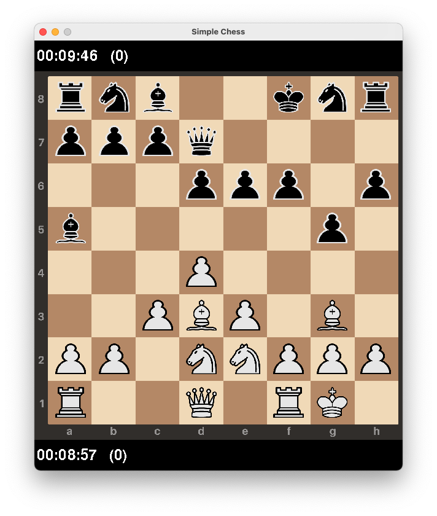

# Simple Chess

A simple chess game written in Python. The chess engine makes use of alpha-beta pruning together with simple heuristics.

## Dependencies

Following modules are required: 

* NumPy
* Pygame

## Usage 

Start a game by running the following:

```
python -m chess.py
```

### Command line arguments

```
Optional arguments:
  -h, --help                                              show help
  -l LEVEL, --level LEVEL                                 level of opponent: 0 := random, >0 := depth in search tree (default 0)
  -t TIMEOUT, --timer TIMEOUT                             timer (in min.) for both players (default 10)
  -s {small,medium,large}, --size {small,medium,large}    size of board (default medium)
  -c {black,white,random}, --colour {black,white,random}  colour player (default random)
  -f FPS, --fps FPS                                       fps game (default 60)
```


